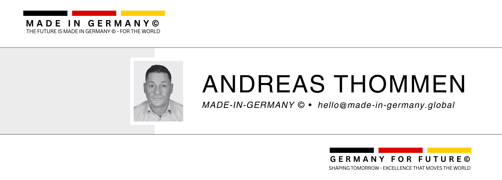

<!-- MADE-IN-GERMANY © -->

  
  
  
  <h1>MADE-IN-GERMANY© GLOBAL</h1>
  
  
Premium German Industrial B2B Portal | <i>Quality Without Compromise</i>

  
  

    <a href="#english" id="en-button">🇬🇧 English</a> | 
    <a href="#german" id="de-button">🇩🇪 Deutsch</a>
  

  
   
  
  
  
  
  
  
  

  
  <h2>🚀 International B2B Platform for Premium German Industrial Products</h2>

## 📋 About

**MADE-IN-GERMANY** is an international B2B portal for high-quality German industrial products. The platform connects manufacturers and bulk buyers worldwide - efficiently, scalably and digitally.

Founder & Project Initiator: **Andreas Thommen**

🔍 Our Vision

 
To establish the definitive global marketplace for premium German industrial products, known for uncompromising quality, reliability, and engineering excellence.

---

## ⚙️ What We Offer

<table>
  <tr>
    <td width="50%">
      <h3>🚢 Container Ordering</h3>
      
Order complete container loads directly through the platform

    </td>
    <td width="50%">
      <h3>🔄 Data Integration</h3>
      
Integration of German manufacturers with XML/CSV product uploads

    </td>
  </tr>
  <tr>
    <td width="50%">
      <h3>🚛 Logistics Control</h3>
      
Central logistics management via warehouses & shipping companies in Germany

    </td>
    <td width="50%">
      <h3>🌐 Global Franchise</h3>
      
Franchise system with local partners in over 50 countries

    </td>
  </tr>
  <tr>
    <td width="50%">
      <h3>💼 Advanced CRM</h3>
      
Multilingual CRM, lead funnel and automated sales system

    </td>
    <td width="50%">
      <h3>🔍 SEO Optimization</h3>
      
SEO-optimized domains/subdomains per target country

    </td>
  </tr>
</table>

---

## 🏭 Industry Focus

  

    <h3>⚙️ Mechanical Engineering & Industrial Plants</h3>
    
Precision machinery and complete industrial solutions

  

  

    <h3>🩺 Medical Technology & Laboratory Equipment</h3>
    
High-precision instruments and reliable medical systems

  

  

    <h3>🍽️ Gastronomy & Hotel Supplies</h3>
    
Professional-grade equipment for hospitality sector

  

  

    <h3>🚗 Automotive Supply</h3>
    
Quality components and systems for the automotive industry

  

  

    <h3>⚗️ Chemical & Pharmaceutical</h3>
    
Specialized solutions for chemical and pharmaceutical production

  

---

## 🔗 Connect With Us

  
  
  
  
  
  
  

<!-- GERMAN VERSION -->

  
  <h2>🚀 Internationale B2B-Plattform für Premium-Industrieprodukte aus Deutschland</h2>

## 📋 Über uns

**MADE-IN-GERMANY** ist ein internationales B2B-Portal für hochwertige deutsche Industrieprodukte. Die Plattform verbindet Hersteller und Großabnehmer weltweit - effizient, skalierbar und digital.

Gründer & Projektinitiator: **Andreas Thommen**

🔍 Unsere Vision

 
Den maßgeblichen globalen Marktplatz für deutsche Premium-Industrieprodukte zu etablieren, bekannt für kompromisslose Qualität, Zuverlässigkeit und technische Exzellenz.

---

## ⚙️ Was wir bieten

<table>
  <tr>
    <td width="50%">
      <h3>🚢 Container-Bestellung</h3>
      
Bestellung kompletter Containerladungen direkt über die Plattform

    </td>
    <td width="50%">
      <h3>🔄 Datenintegration</h3>
      
Integration deutscher Hersteller mit XML-/CSV-Produkt-Uploads

    </td>
  </tr>
  <tr>
    <td width="50%">
      <h3>🚛 Logistiksteuerung</h3>
      
Zentrale Logistiksteuerung über Lager & Speditionen in Deutschland

    </td>
    <td width="50%">
      <h3>🌐 Globales Franchise</h3>
      
Franchise-System mit lokalen Partnern in über 50 Ländern

    </td>
  </tr>
  <tr>
    <td width="50%">
      <h3>💼 Fortschrittliches CRM</h3>
      
Multilinguales CRM, Lead-Funnel und automatisiertes Vertriebssystem

    </td>
    <td width="50%">
      <h3>🔍 SEO-Optimierung</h3>
      
SEO-optimierte Domains/Subdomains je Zielland

    </td>
  </tr>
</table>

---

## 🏭 Branchenfokus

  

    <h3>⚙️ Maschinenbau & Industrieanlagen</h3>
    
Präzisionsmaschinen und komplette Industrielösungen

  

  

    <h3>🩺 Medizintechnik & Laborausstattung</h3>
    
Hochpräzise Instrumente und zuverlässige Medizinsysteme

  

  

    <h3>🍽️ Gastronomie- & Hotelbedarf</h3>
    
Professionelle Ausstattung für den Gastgewerbesektor

  

  

    <h3>🚗 Automobilzulieferung</h3>
    
Qualitätskomponenten und -systeme für die Automobilindustrie

  

  

    <h3>⚗️ Chemie & Pharma</h3>
    
Speziallösungen für die chemische und pharmazeutische Produktion

  

---

## 🔗 Kontaktieren Sie uns

  
  
  
  
  
  
  

<!-- STYLING AND ANIMATION -->

