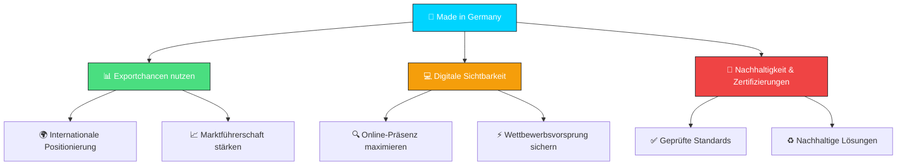
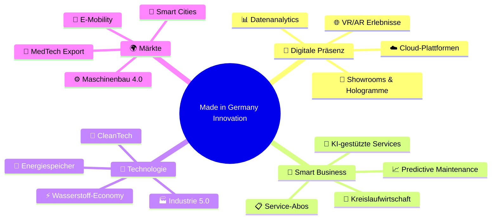
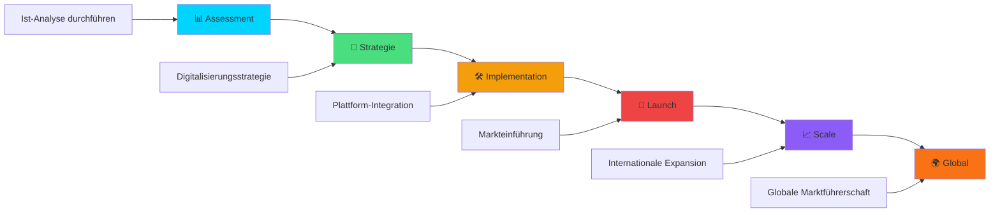
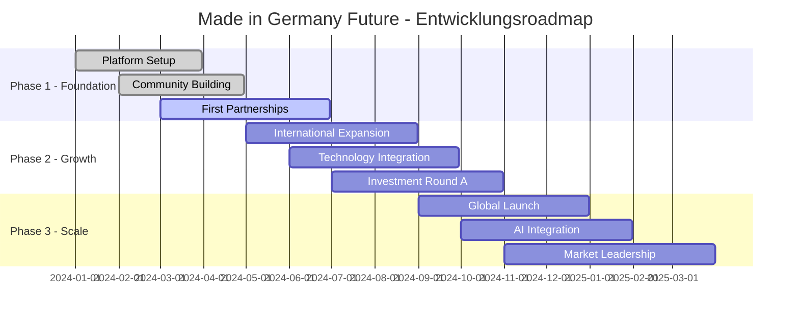

# 🚀 Made in Germany – Zukunft & Chancen Guide

<div align="center">

```ascii
███╗   ███╗ █████╗ ██████╗ ███████╗    ██╗███╗   ██╗     ██████╗ ███████╗██████╗ ███╗   ███╗ █████╗ ███╗   ██╗██╗   ██╗
████╗ ████║██╔══██╗██╔══██╗██╔════╝    ██║████╗  ██║    ██╔════╝ ██╔════╝██╔══██╗████╗ ████║██╔══██╗████╗  ██║╚██╗ ██╔╝
██╔████╔██║███████║██║  ██║█████╗      ██║██╔██╗ ██║    ██║  ███╗█████╗  ██████╔╝██╔████╔██║███████║██╔██╗ ██║ ╚████╔╝ 
██║╚██╔╝██║██╔══██║██║  ██║██╔══╝      ██║██║╚██╗██║    ██║   ██║██╔══╝  ██╔══██╗██║╚██╔╝██║██╔══██║██║╚██╗██║  ╚██╔╝  
██║ ╚═╝ ██║██║  ██║██████╔╝███████╗    ██║██║ ╚████║    ╚██████╔╝███████╗██║  ██║██║ ╚═╝ ██║██║  ██║██║ ╚████║   ██║   
╚═╝     ╚═╝╚═╝  ╚═╝╚═════╝ ╚══════╝    ╚═╝╚═╝  ╚═══╝     ╚═════╝ ╚══════╝╚═╝  ╚═╝╚═╝     ╚═╝╚═╝  ╚═╝╚═╝  ╚═══╝   ╚═╝   
```


<table align="center">
<tr>
<td align="center">

</td>
<td align="center">

</td>
<td align="center">

</td>
</tr>
<tr>
<td align="center">

</td>
<td align="center">

</td>
<td align="center">

</td>
</tr>
</table>

### 🎯 **Die Zukunft deutscher Exzellenz beginnt heute**
*Chancen • Innovation • Nachhaltigkeit • Globaler Erfolg*

</div>

---

## 🌟 Willkommen in der Zukunft von Made in Germany

> **„Made in Germany"** ist weltweit ein **Synonym für Qualität, Präzision und Vertrauen**. Doch heute bedeutet es weit mehr: Es steht für **Innovation, Exportstärke, Digitalisierung und Nachhaltigkeit**.

Dieses Repository bietet einen **umfassenden Überblick** über die Chancen und Perspektiven, die sich aus dem Label „Made in Germany" ergeben – für **Unternehmen**, **Entwickler**, **Investoren** und **Partner**, die deutsche Exzellenz international sichtbar machen wollen.

<div align="center">


</div>

## 🚀 Warum Made in Germany jetzt?

<table>
<tr>
<td width="50%" valign="top">

### 📈 **Kontinuierlich steigende Nachfrage**

Die Nachfrage nach deutschen Produkten steigt kontinuierlich – von **Maschinenbau** über **Medizintechnik**, **Automobilbau**, **Landwirtschaftstechnik**, **Wasserstofftechnologie** bis hin zu **Hightech-Lösungen** für Energieeffizienz und Nachhaltigkeit.

</td>
<td width="50%" valign="top">

### 🌐 **Globale Marktanforderungen**

Gleichzeitig verlangt der globale Markt nach **klarer Kommunikation**, **digitalen Plattformen** und **internationaler Reichweite**.

</td>
</tr>
</table>

### 🎯 **Drei Säulen des Erfolgs**

<div align="center">



</div>

#### 🎪 **Exportchancen nutzen**
Unternehmen können ihre Produkte international stärker positionieren und neue Märkte erschließen.

#### 🔮 **Digitale Sichtbarkeit**  
Nur wer online sichtbar ist, bleibt im Wettbewerb führend und erreicht globale Zielgruppen.

#### ♻️ **Nachhaltigkeit & Zertifizierungen**
Internationale Märkte erwarten geprüfte Standards und nachhaltige Lösungen – beides zentrale Stärken von „Made in Germany".

---

## 💼 Chancen für alle Akteure

<div align="center">

### 🎭 **Unser Ökosystem der Exzellenz**

<table>
<tr>
<td align="center" width="25%">

<h4>🏭 Unternehmen</h4>
</td>
<td align="center" width="25%">

<h4>💰 Investoren</h4>
</td>
<td align="center" width="25%">

<h4>👨‍💻 Entwickler</h4>
</td>
<td align="center" width="25%">

<h4>🤝 Partner</h4>
</td>
</tr>
</table>

</div>

### 🏭 **Für Unternehmen**
<details>
<summary><strong>🚀 Reichweite & Vertrieb optimieren</strong></summary>

- **📊 Internationale Reichweite steigern** - Erschließung neuer Märkte mit bewährter deutscher Qualität
- **🎯 Vertrieb optimieren** - Effiziente Distributionskanäle und digitale Plattformen nutzen  
- **🤝 B2B-Kunden gewinnen** - Langfristige Geschäftsbeziehungen mit internationalen Partnern aufbauen
- **💼 Markenwert stärken** - Das Made-in-Germany-Label als Qualitätsmerkmal positionieren
</details>

### 💰 **Für Investoren & Sponsoren**
<details>
<summary><strong>🌍 Zugang zu globalen Märkten</strong></summary>

- **🌐 Globale Markterschließung** - Beteiligung an einem starken Made-in-Germany-Ökosystem
- **🌱 Nachhaltige Branchen** - Investitionen in zukunftsfähige und umweltfreundliche Technologien
- **📈 Stabile Markenwerte** - Langfristige Wertsteigerung durch etablierte deutsche Qualitätsstandards
- **⚡ Innovative Technologien** - Early-Stage-Zugang zu bahnbrechenden deutschen Innovationen
</details>

### 👨‍💻 **Für Entwickler & Studenten**
<details>
<summary><strong>🎓 Internationale Referenzen aufbauen</strong></summary>

- **💡 Innovative Projekte entwickeln** - Mitarbeit an zukunftsweisenden deutschen Technologien
- **🏆 Praktische Referenzen sammeln** - Portfolio mit international anerkannten Projekten aufbauen
- **🚪 Türen öffnen** - Networking mit führenden deutschen Unternehmen und Experten
- **📚 Kompetenzen erweitern** - Zugang zu modernsten Technologien und Methoden
</details>

### 🤝 **Für strategische Partner**
<details>
<summary><strong>🔄 Skalierbare Geschäftsmodelle</strong></summary>

- **🏭 Industrie-Forschung-Kooperationen** - Synergien zwischen Praxis und Wissenschaft schaffen
- **📱 Plattform-Integration** - Technologische Infrastruktur für globale Skalierung bereitstellen
- **⚙️ Geschäftsmodell-Innovation** - Neue Wertschöpfungsketten und Service-Angebote entwickeln
- **🌍 Internationale Expansion** - Gemeinsame Markterschließung in strategisch wichtigen Regionen
</details>

---

## 🔬 Innovationsfelder der Zukunft

> **„Made in Germany"** entwickelt sich zu einem **internationalen Innovationsmotor**. Die relevanten Felder definieren die Zukunft:

<div align="center">

### 🎨 **Innovation Canvas**



</div>

### 🎭 **Digitale Showrooms & Hologramm-Technologie**

<table>
<tr>
<td width="60%">

**Revolutionäre Präsentationsformen für globales Vertrauen**

Deutsche Präzision trifft auf modernste Visualisierungstechnologie. Hologramme und immersive digitale Showrooms ermöglichen es deutschen Unternehmen, ihre Produkte weltweit zu präsentieren, ohne physisch anwesend zu sein.

**Kernvorteile:**
- 🌍 **Globale Reichweite** ohne Reisekosten
- ⚡ **Interaktive Produktdemonstrationen** in Echtzeit  
- 🎯 **Personalisierte Kundenerlebnisse** für verschiedene Märkte
- 📊 **Datenbasierte Insights** über Kundeninteraktionen

</td>
<td width="40%">


</td>
</tr>
</table>

### ⚙️ **Smart Services & Abomodelle**

**Langfristige Kundenbeziehungen durch innovative Servicekonzepte**

- 📱 **Service-as-a-Service (SaaS)** - Kontinuierliche Betreuung statt Einmalverkauf
- 🔄 **Predictive Maintenance** - Vorhersagebasierte Wartung für maximale Uptime
- 📊 **Performance Monitoring** - Echtzeitüberwachung und Optimierung der Anlagenleistung
- 💡 **Upgrade-Zyklen** - Kontinuierliche Modernisierung und Technologie-Updates

### 🌐 **Plattform-Strategien**

**Weltweite Skalierung deutscher Produkte und Dienstleistungen**

<div align="center">

| Plattform-Typ | Zielgruppe | Nutzen | Status |
|---------------|------------|--------|--------|
| 🏭 **B2B Marktplätze** | Industriekunden | Direkter Zugang zu deutschen Herstellern | ✅ Aktiv |
| 🔧 **Service-Plattformen** | Wartungsdienstleister | Zentralisierte Service-Koordination | 🔄 In Entwicklung |
| 📚 **Wissens-Hubs** | Entwickler & Ingenieure | Technologie-Transfer und Best Practices | 🚀 Geplant |
| 🌱 **Sustainability-Netzwerke** | Nachhaltigkeitsfokussierte Unternehmen | ESG-konforme Lieferketten | ⚡ Innovation |

</div>

### ⚡ **Energieeffizienz & Wasserstofftechnologien**

<table>
<tr>
<td width="50%">

#### 🔋 **Wasserstoff-Economy**
- **Grüne Wasserstoffproduktion** via Elektrolyse
- **Transport & Speicherung** innovativer Systeme
- **Industrielle Anwendungen** in Stahl-, Chemie- und Zementindustrie
- **Mobility Solutions** für Schwerlastverkehr und Schifffahrt

</td>
<td width="50%">

#### 🌱 **Energieeffizienz 4.0**  
- **Smart Grids** für optimierte Energieverteilung
- **AI-basierte Verbrauchsoptimierung**
- **Energiespeicher-Technologien** der nächsten Generation
- **Sektorenkopplung** zwischen Strom, Wärme und Mobilität

</td>
</tr>
</table>

---

## 🎯 Unsere Mission

<div align="center">

### 🌟 **Deutsche Exzellenz international stärken und sichtbar machen**

<table>
<tr>
<td align="center" width="25%">

<h4>📤 Export fördern</h4>
<p>Förderung des Exports deutscher Qualitätsprodukte</p>
</td>
<td align="center" width="25%">

<h4>🌐 Netzwerk aufbauen</h4>
<p>Aufbau eines vertrauenswürdigen Netzwerks</p>
</td>
<td align="center" width="25%">

<h4>🏆 Vorsprung sichern</h4>
<p>Wettbewerbsvorteile durch Innovation</p>
</td>
<td align="center" width="25%">

<h4>🎓 Talente fördern</h4>
<p>Unterstützung junger Talente</p>
</td>
</tr>
</table>

</div>

### 🎯 **Unsere vier Säulen**

```yaml
🔹 Export-Excellence:
  - Förderung deutscher Qualitätsprodukte im Weltmarkt
  - Erschließung neuer internationaler Absatzmärkte  
  - Stärkung der deutschen Exportposition
  - Aufbau strategischer Handelspartnerschaften

🔹 Vertrauensvolles Netzwerk:
  - Aufbau eines globalen Ökosystems
  - Verbindung zwischen Unternehmen, Investoren und Partnern
  - Qualitätssicherung durch strenge Auswahlkriterien
  - Langfristige, nachhaltige Geschäftsbeziehungen

🔹 Competitive Advantage:
  - Sicherung von Wettbewerbsvorteilen durch Innovation
  - Fokus auf Nachhaltigkeit und Digitalisierung
  - Kontinuierliche Technologieentwicklung
  - Marktführerschaft in Schlüsseltechnologien

🔹 Talent Development:
  - Unterstützung junger Talente und Entwickler
  - Brücke zwischen Ausbildung und Industrie
  - Förderung von Innovationsgeist und Unternehmertum
  - Internationale Karrieremöglichkeiten schaffen
```

---

## 🌍 Schlüsselindustrien im Focus

<div align="center">

### 🏭 **Deutsche Industrieexzellenz**

</div>

<table>
<tr>
<td width="50%">

### 🏥 **Medizintechnik**
**Weltmarktführer in Innovation & Qualität**

- 🔬 **Diagnostische Geräte** - Präzision rettet Leben
- 🦴 **Chirurgische Instrumente** - Millimetergenaue Eingriffe  
- 💊 **Pharmatechnik** - Sichere Medikamentenproduktion
- 🫀 **Implantat-Technologie** - Langlebige Körperersatzteile


</td>
<td width="50%">

### ⚙️ **Maschinenbau**
**Precision Engineering für die Welt**

- 🔧 **Werkzeugmaschinen** - Präzision in Perfektion
- 🤖 **Automatisierungstechnik** - Industrie 4.0 Leadership
- 🏗️ **Anlagenbau** - Komplexe Systeme, einfach gemacht
- ⚡ **Energiemaschinen** - Effizienz & Nachhaltigkeit


</td>
</tr>
<tr>
<td width="50%">

### 🚗 **Automobilbau**
**Mobilität der Zukunft gestalten**

- 🔋 **E-Mobilität** - Elektrische Revolution
- 🤖 **Autonomes Fahren** - KI on the Road
- ⚡ **Antriebstechnik** - Effizienz maximiert
- 🛡️ **Sicherheitssysteme** - Schutz für alle


</td>
<td width="50%">

### 🌾 **Landwirtschaftstechnik**
**Ernährung sichern, Umwelt schützen**

- 🚜 **Smart Farming** - Präzisionslandwirtschaft
- 🌱 **Sustainable Agriculture** - Umweltschonend produzieren
- 📊 **AgriTech Solutions** - Daten für bessere Ernten
- 🔄 **Kreislaufwirtschaft** - Ressourcen optimal nutzen


</td>
</tr>
</table>

---

## 🚀 Get Started - Werde Teil der Bewegung

<div align="center">

### 🎯 **Dein Weg zur deutschen Exzellenz**

</div>

<details>
<summary>🏢 <strong>Als Unternehmen durchstarten</strong></summary>

### 📋 **Roadmap für Unternehmen**



**🎯 Nächste Schritte:**
1. **Analysiere** deine aktuellen Export-Potentiale
2. **Entwickle** eine digitale Go-to-Market-Strategie  
3. **Implementiere** moderne Technologien und Plattformen
4. **Launche** deine Produkte auf internationalen Märkten
5. **Skaliere** dein Geschäft global mit deutschen Qualitätsstandards

</details>

<details>
<summary>💰 <strong>Als Investor partizipieren</strong></summary>

### 💎 **Investment Opportunities**

| Investment-Typ | Risiko | Return Potential | Zeithorizont |
|----------------|--------|------------------|--------------|
| 🏭 **Industrial Tech** | ⭐⭐⭐ | 🚀🚀🚀🚀 | 3-5 Jahre |
| 🌱 **GreenTech** | ⭐⭐ | 🚀🚀🚀🚀🚀 | 5-10 Jahre |
| 🔬 **MedTech** | ⭐⭐⭐⭐ | 🚀🚀🚀🚀🚀 | 7-12 Jahre |
| 💻 **DigitalTech** | ⭐⭐⭐⭐⭐ | 🚀🚀🚀🚀🚀 | 2-4 Jahre |

**📈 Investment Vorteile:**
- 🏆 **Bewährte Qualität** - Deutsche Standards als Risikominimierung
- 🌍 **Globaler Markt** - Weltweite Nachfrage nach deutschen Produkten
- 💼 **Diversifikation** - Zugang zu verschiedenen Branchen und Märkten  
- 🔄 **Nachhaltigkeit** - ESG-konforme Investments mit Zukunftspotential

</details>

<details>
<summary>👨‍💻 <strong>Als Entwickler einsteigen</strong></summary>

### 🔧 **Developer Toolkit**

**🛠️ Technologien & Skills:**
```bash
# Core Technologies
- 🏭 Industrial IoT & Edge Computing
- 🤖 AI/ML für Produktionsoptimierung  
- 🔗 Blockchain für Supply Chain
- 📱 Mobile Apps für B2B-Kunden
- ☁️ Cloud-Plattformen & Microservices
- 🔐 Cybersecurity für Industrieanlagen

# Business Skills  
- 📊 Business Intelligence & Analytics
- 🎯 Product Management & UX
- 🌐 International Business Development
- 🔄 Agile Methodologies & DevOps
```

**🚀 Entwicklermöglichkeiten:**
- **Open Source Projekte** - Beitrag zu deutschen Tech-Standards
- **Startup-Kooperationen** - Aufbau innovativer B2B-Lösungen
- **Corporate Innovation** - Digitalisierung etablierter Industrien  
- **International Projects** - Globale Software-Entwicklung für deutsche Unternehmen

</details>

<details>
<summary>🤝 <strong>Als Partner kooperieren</strong></summary>

### 🌐 **Partnership Modelle**

```yaml
🔹 Technologie-Partnerschaft:
  - Integration von Plattformen und APIs
  - Gemeinsame Produktentwicklung
  - White-Label-Lösungen für deutsche Hersteller
  - Cross-Innovation zwischen verschiedenen Branchen

🔹 Vertriebs-Partnerschaft:
  - Internationale Distributionskanäle  
  - Lokale Markterschließung und Support
  - Multi-Channel-Strategien für B2B-Märkte
  - Langfristige Exklusivverträge

🔹 Forschungs-Partnerschaft:
  - Kooperative F&E-Projekte
  - Technologie-Transfer zwischen Industrie und Wissenschaft
  - Fördergelder und EU-Programme nutzen
  - Internationale Forschungsnetzwerke

🔹 Strategic Alliance:
  - Joint Ventures für neue Märkte
  - Gemeinsame Infrastruktur und Plattformen  
  - Risiko- und Kostenteilung bei Großprojekten
  - Langfristige strategische Ausrichtung
```

</details>

---

## 📞 Community & Support

<div align="center">

### 🤝 **Werde Teil unserer Community**

<table>
<tr>
<td align="center">
<a href="https://made-in-germany-future.com">

</a>
</td>
<td align="center">
<a href="mailto:zukunft@made-in-germany-future.com">

</a>
</td>
</tr>
<tr>
<td align="center">
<a href="https://discord.gg/made-in-germany-future">

</a>
</td>
<td align="center">
<a href="https://linkedin.com/company/made-in-germany-future">

</a>
</td>
</tr>
<tr>
<td align="center">
<a href="https://docs.made-in-germany-future.com">

</a>
</td>
<td align="center">
<a href="https://github.com/made-in-germany-future">

</a>
</td>
</tr>
</table>

### 📞 **Direkter Kontakt**

```yaml
🔹 Geschäftliche Anfragen:
  - 📧 business@made-in-germany-future.com
  - 📱 +49 (0) 30 12345-678
  - 🏢 Innovation Campus Berlin, Deutschland

🔹 Technischer Support:  
  - 💻 tech@made-in-germany-future.com
  - 🛠️ Entwickler-Support via Discord
  - 📖 Umfassende Dokumentation verfügbar

🔹 Partnership & Investment:
  - 🤝 partners@made-in-germany-future.com  
  - 💰 invest@made-in-germany-future.com
  - 🌍 International Expansion Team

🔹 Presse & Medien:
  - 📰 press@made-in-germany-future.com
  - 📸 Pressekit & Assets verfügbar
  - 🎤 Interview-Anfragen willkommen
```

</div>

---

## 📊 Projekt-Metriken & Status

<div align="center">

### 📈 **Live Dashboard**

<table>
<tr>
<td width="50%" align="center">


</td>
<td width="50%" align="center">


</td>
</tr>
</table>

### 🏆 **Achievements & Milestones**


</div>

### 🎯 **Roadmap & Milestones**



---

## 🏆 Erfolgsgeschichten & Case Studies

<div align="center">

### ⭐ **Success Stories**

</div>

<table>
<tr>
<td width="33%" align="center">
<h4>🏭 Maschinenbau AG</h4>

<p><em>Internationale Expansion in 15 Länder durch digitale Plattformen</em></p>
</td>
<td width="33%" align="center">
<h4>⚡ Energy Solutions GmbH</h4>

<p><em>Globaler Marktführer bei Wasserstoff-Elektrolyseuren</em></p>
</td>
<td width="33%" align="center">
<h4>🏥 MedTech Innovations</h4>

<p><em>Revolutionäre Diagnostikgeräte in 80+ Ländern</em></p>
</td>
</tr>
</table>

### 📈 **Impact Metrics**

<div align="center">

| KPI | 2023 | 2024 (Prognose) | Wachstum |
|-----|------|------------------|----------|
| 🌍 **Exportvolumen** | €1.8B | €2.4B | +33% |
| 🏢 **Partner Unternehmen** | 127 | 200+ | +57% |
| 💼 **Arbeitsplätze geschaffen** | 2,350 | 3,800+ | +62% |
| 🌱 **CO₂ Reduktion (Tonnen)** | 45,000 | 78,000+ | +73% |

</div>

---

## 🎨 Brand Assets & Resources

<div align="center">

### 🎯 **Made in Germany Future Brand**

<table>
<tr>
<td align="center">
<h4>🎨 Logo Varianten</h4>


</td>
<td align="center">
<h4>🌈 Farb-Palette</h4>


</td>
<td align="center">
<h4>📐 Design Guidelines</h4>


</td>
</tr>
</table>

</div>

---

## 🔮 Abschlussbotschaft

<div align="center">


### 🌟 **Made in Germany ist mehr als ein Herkunftssiegel**

> **Es ist eine globale Marke, die für Qualität, Innovation, Nachhaltigkeit und Zukunftsfähigkeit steht.**

**Dieses Projekt ist eine Einladung** an **Unternehmen**, **Investoren**, **Entwickler**, **Studenten** und **strategische Partner**, gemeinsam ein **Ökosystem zu schaffen**, das deutsche Produkte und Technologien **weltweit stärkt**.

<table>
<tr>
<td align="center" width="25%">

<h4>🏆 Qualität</h4>
<p>Deutsche Präzision & Zuverlässigkeit</p>
</td>
<td align="center" width="25%">

<h4>💡 Innovation</h4>  
<p>Technologieführerschaft & F&E</p>
</td>
<td align="center" width="25%">

<h4>🌱 Nachhaltigkeit</h4>
<p>Umweltschutz & Kreislaufwirtschaft</p>
</td>
<td align="center" width="25%">

<h4>🚀 Zukunft</h4>
<p>Internationale Expansion & Wachstum</p>
</td>
</tr>
</table>

### 💎 **Wer Teil von „Made in Germany Future" wird...**

**...investiert nicht nur in eine Marke, sondern in eine Zukunft voller Chancen, Innovation und internationaler Exzellenz.**


---

### 🎯 **Ready to Start? Deine Reise beginnt jetzt!**

<table>
<tr>
<td align="center">
<a href="https://made-in-germany-future.com/onboarding">

</a>
</td>
<td align="center">
<a href="https://discord.gg/made-in-germany-future">

</a>
</td>
<td align="center">
<a href="mailto:contact@made-in-germany-future.com">

</a>
</td>
</tr>
</table>

</div>

---

<div align="center">


### 🌟 **„Die Zukunft ist Made in Germany – Gestalte sie mit!"** 🌟

**🔧 Deutsche Ingenieurskunst trifft globale Vision | Innovation schafft Werte 🌎**

*Dein Partner für internationale Exzellenz und nachhaltigen Erfolg*

---


**© 2024 Made in Germany Future Initiative | Alle Rechte vorbehalten**

</div>
