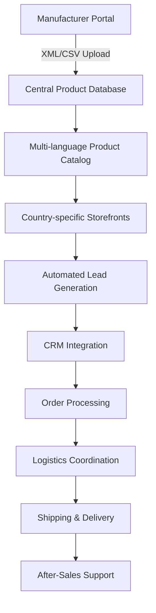

# 🇩🇪 MADE-IN-GERMANY® 🇩🇪

### *Premium German Industrial Products, Worldwide Distribution*

  <a href="#-vision">Vision</a> •
  <a href="#-services">Services</a> •
  <a href="#-industries">Industries</a> •
  <a href="#-technology">Technology</a> •
  <a href="#-franchise">Franchise</a> •
  <a href="#-contact">Contact</a>

 

## 🚀 Vision

> *Connecting premium German manufacturers with global business customers through innovative digital solutions*

**Made in Germany** is an international B2B portal founded by **Andreas Thommen** that serves as the ultimate bridge between German industrial excellence and worldwide business customers. We leverage cutting-edge technology to create seamless connections between manufacturers and bulk buyers worldwide—efficiently, scalably, and digitally.

 

## 💼 Services

| Service | Description |
|:-------:|:------------|
| 🚢 **Container Orders** | Place orders for complete container shipments directly through our platform |
| 🔄 **Integration** | Seamless onboarding of German manufacturers with XML/CSV product uploads |
| 🚚 **Logistics** | Centralized logistics management via warehouses & shipping partners in Germany |
| 🌐 **Global Network** | Franchise system with local partners in over 50 countries worldwide |
| 💻 **Sales Automation** | Multilingual CRM, lead funnel, and automated sales systems |
| 🔍 **SEO Optimization** | Targeted domains/subdomains for each destination country |

 

## 🏭 Industries

We specialize in connecting buyers and sellers across these premium German industrial sectors:

<table align="center">
  <tr>
    <td align="center"> <b>Machinery & Industrial Equipment</b></td>
    <td align="center"> <b>Medical Technology & Lab Equipment</b></td>
    <td align="center"> <b>Gastronomy & Hotel Supplies</b></td>
  </tr>
  <tr>
    <td align="center"> <b>Automotive Supply Chain</b></td>
    <td align="center"> <b>Chemical & Pharmaceutical</b></td>
    <td align="center"> <b>Innovation & Engineering</b></td>
  </tr>
</table>

 

## 💻 Technology

Our platform is built on cutting-edge technology to ensure seamless global operations:

```mermaid
graph TD
    A[Manufacturer Portal] -->|XML/CSV Upload| B[Central Product Database]
    B --> C[Multi-language Product Catalog]
    C --> D[Country-specific Storefronts]
    D --> E[Automated Lead Generation]
    E --> F[CRM Integration]
    F --> G[Order Processing]
    G --> H[Logistics Coordination]
    H --> I[Shipping & Delivery]
    I --> J[After-Sales Support]
```

 

## 🌐 Franchise

Join our global network of franchise partners! Benefits include:

- **Exclusive Territory** - Become the sole representative in your region
- **Proven Business Model** - Leverage our established operations system
- **Comprehensive Training** - Learn from industry experts
- **Marketing Support** - Access professional marketing materials
- **Technical Infrastructure** - Use our advanced digital platform

📋 <b>Franchise Requirements</b>

 
<ul>
  <li>Industry experience in B2B sales</li>
  <li>Strong business network in target country</li>
  <li>Financial capability for initial investment</li>
  <li>Commitment to growth and excellence</li>
</ul>

 

## 📬 Contact

---

© 2025 MADE-IN-GERMANY. All rights reserved.
  
 
<i>Quality • Reliability • Innovation</i>

<!-- 
ANIMATIONS AND INTERACTIVE ELEMENTS:
This README uses several elements that create a dynamic appearance when viewed on GitHub:
1. Animated emoji icons from the Fluent Emoji collection
2. Collapsible sections using 
 tags
3. Mermaid diagram for visual process flow
4. Interactive badges with links
5. Responsive tables and layout
-->
